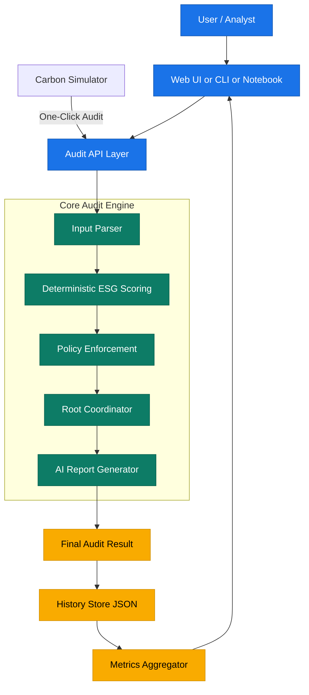
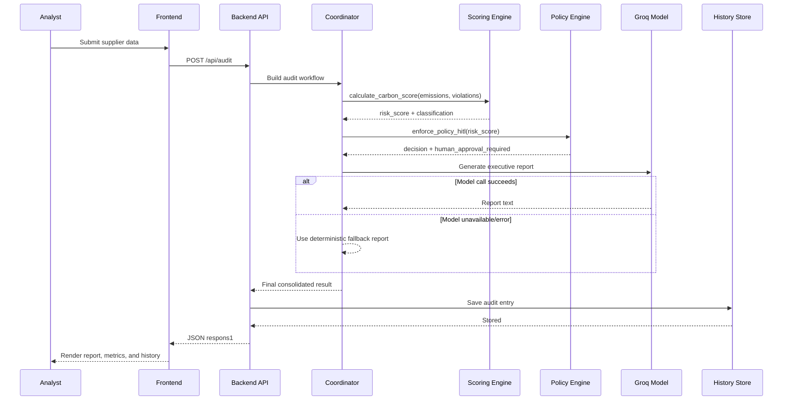

<p align="center">

</p>

<h1 align="center">🌱 Carbon Footprint Optimization Engine (CfoE)</h1>
<h3 align="center">Agentic ESG Compliance for Supplier Risk Intelligence</h3>

<p align="center">
  
  
  
  
  
</p>

<p align="center">
  <a href="#-quick-start">Quick Start</a> •
  <a href="#-features">Features</a> •
  <a href="#-gazette-compliance">Gazette Compliance</a> •
  <a href="#-blockchain-setup">Blockchain</a> •
  <a href="#-documentation">Documentation</a>
</p>

---

## 📋 Overview

**CfoE** is an enterprise-grade, multi-agent ESG audit system that revolutionizes supplier carbon risk assessment. Built with deterministic scoring algorithms, blockchain-anchored audit trails, and AI-powered reporting, CfoE delivers:

✅ **Regulatory Compliance** - Full Gazette requirements implementation  
✅ **Blockchain Verification** - Immutable audit trails on Algorand  
✅ **Real-Time Monitoring** - Live emissions tracking and instant audits  
✅ **Multi-Modal Access** - Web dashboard, CLI, or Jupyter notebook  
✅ **Tokenized Credits** - Tradeable carbon credits as ASA tokens  

### 🎯 Why CfoE?

- **Faster Audits**: Automated multi-agent pipeline reduces audit time by 80%
- **Consistent Scoring**: Deterministic algorithms ensure reproducible results
- **Regulatory Ready**: Built-in compliance with sector-specific emission targets
- **Transparent & Auditable**: Every decision recorded on blockchain
- **AI-Enhanced**: Executive summaries and recommendations via LLM

---

## 🚀 Quick Start

### Installation

```bash
# Clone repository
git clone <repository-url>
cd cfoe-blockchain

# Create virtual environment
python -m venv venv

# Activate environment
# Windows:
venv\Scripts\activate
# Unix/MacOS:
source venv/bin/activate

# Install dependencies
pip install -r requirements.txt
```

### Configuration

Create `.env` file in project root:

```env
# Required: AI Model API
GROQ_API_KEY=your_groq_api_key_here

# Optional: Blockchain (for on-chain features)
ALGORAND_ADDRESS=your_wallet_address
ALGORAND_PRIVATE_KEY=your_private_key
ALGOD_SERVER=https://testnet-api.algonode.cloud
ALGOD_TOKEN=

# Optional: External monitoring
TAVILY_API_KEY=your_tavily_api_key_here
```

### Launch

**Option 1: Web Dashboard (Recommended)**
```bash
# Terminal 1: Main CfoE App
uvicorn webapp:app --reload --port 8001
# Open: http://localhost:8001

# Terminal 2: Real-Time Simulator (Optional)
uvicorn simulator.simulator:app --reload --port 8000
# Open: http://localhost:8000
```

**Option 2: CLI Mode**
```bash
python main.py
```

**Option 3: Jupyter Notebook**
```bash
jupyter notebook global-cfoe.ipynb
```

---

## 📚 Table of Contents

- [Overview](#-overview)
- [Quick Start](#-quick-start)
- [Features](#-features)
- [Gazette Compliance](#-gazette-requirements-compliance)
- [Architecture](#-architecture)
- [Tech Stack](#-tech-stack-and-prerequisites)
- [Project Structure](#-project-structure)
- [User Guide](#-user-instructions)
- [Developer Guide](#-developer-instructions)
- [Blockchain Setup](#-blockchain-setup)
- [Carbon Credits](#-carbon-credit-token-system)
- [Real-Time Logs](#-real-time-audit-logs)
- [Contributing](#-contributor-expectations)
- [Known Issues](#-known-issues)
- [Documentation](#-additional-documentation)

---

## ✨ Features

| Feature                       | What it Gives You                                   |
| ----------------------------- | --------------------------------------------------- |
| Multi-Agent Pipeline          | Structured flow from monitoring to final report     |
| Deterministic Risk Scoring    | Stable and auditable ESG scores for the same inputs |
| Sector-Specific Targets       | Custom risk thresholds for 5 industry sectors       |
| Normalized Emissions Metrics  | tCO2eq/tonne, tCO2eq/MBBLS, tCO2eq/NRGF intensity   |
| Pro-Rata Target Calculation   | Time-adjusted targets for mid-year audits           |
| Entity Registry Validation    | Obligated entity lookup with registration IDs       |
| Multi-Year Trajectory         | Historical trend analysis and compliance tracking   |
| Policy Enforcement            | Automatic action routing based on risk thresholds   |
| HITL Safety Gate              | High-risk cases marked for human review             |
| Blockchain Integration        | On-chain audit anchoring with Algorand              |
| Carbon Credit Tokens          | Fungible ASA tokens for tradeable emission credits |
| Audit Certificate NFTs        | Unique 1-of-1 NFTs for compliance proof            |
| AI Reporting                  | Executive summaries and recommendations             |
| Web Dashboard                 | Submit, compare, and track audits interactively     |
| Real-Time Simulator           | Live emissions streaming and one-click data audits  |
| Real-Time Audit Logs          | WebSocket-powered live progress tracking during audits |
| Audit Info Modal              | Inspect full details for any selected history audit |
| Multi-Format Output Export    | Per-job exports in JSON/TXT/MD/HTML/CSV/PDF/DOCX    |
| Local History Store           | Persist previous audits for analysis                |
| Notebook + Script + Web Modes | Flexible usage based on workflow preference         |

---

## 📜 Gazette Requirements Compliance

### ✅ All 5 Critical Requirements Implemented

CfoE fully addresses all critical gaps identified in regulatory Gazette requirements:

| # | Gazette Requirement | CfoE Status | Implementation |
|---|---------------------|-------------|----------------|
| 1 | **Sector-specific emission intensity targets**<br/>(aluminium, refinery, petrochemicals, textiles) | ✅ **COMPLETE** | 5 sectors with custom low/critical thresholds and baseline/target intensities |
| 2 | **Normalised output metric per sector**<br/>(tCO2eq/tonne, tCO2eq/MBBLS/NRGF) | ✅ **COMPLETE** | Production volume + unit fields with emissions intensity calculation |
| 3 | **Multi-year compliance trajectory**<br/>(baseline 2023-24, targets 2025-26 and 2026-27) | ✅ **COMPLETE** | Historical trend analysis with on-track status assessment |
| 4 | **Obligated entity registry lookup**<br/>(registration no. like REFOE001MP, TXTOE007PB) | ✅ **COMPLETE** | Entity registry with real-time validation API |
| 5 | **Pro-rata target calculation for mid-year notification**<br/>(Note 3: Jan–Mar 2026 pro-rated from annual target) | ✅ **COMPLETE** | Date-based linear interpolation from baseline to target |

### Feature Details

#### 1. Sector-Specific Targets
- **Aluminium:** low < 0.30, critical ≥ 0.65 (baseline: 15.0 → target: 10.0 tCO2eq/tonne)
- **Refinery:** low < 0.35, critical ≥ 0.70 (baseline: 25.0 → target: 18.0 tCO2eq/MBBLS)
- **Petrochemicals:** low < 0.40, critical ≥ 0.75 (baseline: 30.0 → target: 22.0 tCO2eq/tonne)
- **Textiles:** low < 0.25, critical ≥ 0.60 (baseline: 8.0 → target: 5.0 tCO2eq/tonne)
- **General Industry:** low < 0.40, critical ≥ 0.70 (baseline: 20.0 → target: 15.0 tCO2eq/tonne)

#### 2. Normalized Metrics
```python
emissions_intensity = emissions / production_volume

# Scoring based on deviation from expected intensity:
≤ 80% of expected  → 0.05 (excellent)
≤ 100% of expected → 0.15 (good)
≤ 120% of expected → 0.30 (acceptable)
> 120% of expected → 0.50 (poor)
```

#### 3. Multi-Year Trajectory
- Tracks historical audits per supplier
- Calculates trend: 📈 Improving / 📉 Deteriorating / ➡️ Stable
- Assesses on-track status: ✅ On Track / ⚠️ Behind Schedule
- Displays recent audit history with scores

#### 4. Entity Registry
- Sample entities: REFOE001MP, TXTOE007PB, ALMOE003EU, PETOE009AS
- Real-time validation in UI
- API endpoints: `/api/registry/validate/{id}`, `/api/registry/entity/{id}`

#### 5. Pro-Rata Calculation
```python
progress_ratio = days_elapsed / total_days
expected_intensity = baseline - (baseline - target) × progress_ratio

# Example (mid-2025, 40% progress):
Baseline (2023): 20.0 tCO2eq/tonne
Target (2027): 15.0 tCO2eq/tonne
Expected: 18.0 tCO2eq/tonne
```

### Testing Gazette Compliance

```bash
# Test all Gazette features
python test_phase1.py          # Sectors, Pro-Rata, Normalized Metrics
python test_phase2_phase3.py   # Registry, Trajectory

# Start UI for manual testing
uvicorn webapp:app --reload
```

### Documentation
- **Complete Guide:** `CRITICAL_GAPS_IMPLEMENTATION.md`
- **Quick Reference:** `QUICK_REFERENCE.md`
- **Summary:** `ALL_GAPS_COMPLETE_SUMMARY.md`

---

## 🛠️ Tech Stack and Prerequisites

### Tech Stack

| Layer         | Technology                            | Purpose                                  |
| ------------- | ------------------------------------- | ---------------------------------------- |
| Language      | Python 3.10+                          | Core implementation                      |
| Blockchain    | Algorand (Testnet)                    | On-chain audit anchoring and verification|
| AI SDK        | groq                                  | LLM content generation                   |
| Web API       | FastAPI                               | Backend endpoints for audits and metrics |
| Web Server    | Uvicorn                               | Local ASGI server                        |
| Frontend      | HTML, CSS, JavaScript                 | Interactive dashboard UI                 |
| Export Engine | reportlab, python-docx                | PDF and DOCX generation                  |
| Configuration | python-dotenv                         | Environment variable loading             |
| Storage       | JSON file (`data/audit_history.json`) | Local audit history                      |

### Prerequisites

| Requirement         | Notes                                |
| ------------------- | ------------------------------------ |
| Python 3.10+        | Verified with local venv setup       |
| Groq API Key        | Set `GROQ_API_KEY` in `.env`         |
| Algorand Wallet     | Optional for blockchain features     |
| AlgoKit CLI         | Optional for local blockchain testing|
| Internet access     | Needed for live model calls          |
| Virtual environment | Recommended for dependency isolation |

---

## 🏗️ Architecture

### System Architecture



### Audit Flow (Detailed)



---

## 📁 Project Structure

```text
CO2 footprint/
├── agents/
│   ├── calculation_agent.py      # Sector-specific scoring + pro-rata
│   ├── registry_agent.py         # Entity registry validation
│   ├── trajectory_agent.py       # Multi-year trend analysis
│   ├── monitor_agent.py
│   ├── policy_agent.py
│   └── reporting_agent.py
├── orchestrators/
│   └── root_coordinator.py
├── web/
│   ├── index.html
│   └── static/
│       ├── app.js
│       └── styles.css
├── simulator/
│   ├── simulator.py              # FastAPI real-time emissions generator (port 8000)
│   └── dashboard.html            # Standalone visual dashboard for the simulator
├── data/
│   └── audit_history.json
├── outputs/
│   ├── audits_master.csv
│   └── job-<job_id>/
│       ├── aud-<audit_id>.json
│       ├── aud-<audit_id>.txt
│       ├── aud-<audit_id>.md
│       ├── aud-<audit_id>.html
│       ├── aud-<audit_id>.csv
│       ├── aud-<audit_id>.pdf
│       └── aud-<audit_id>.docx
├── docs/
│   ├── README.md
│   ├── CRITICAL_GAPS_IMPLEMENTATION.md
│   ├── ALL_GAPS_COMPLETE_SUMMARY.md
│   └── QUICK_REFERENCE.md
├── blockchain_client.py          # Algorand integration
├── webapp.py
├── main.py
├── main_simple.py
├── global-cfoe.ipynb
├── test_phase1.py                # Test sectors, pro-rata, metrics
├── test_phase2_phase3.py         # Test registry, trajectory
├── requirements.txt
└── README.md
```

---

## 👥 User Instructions

### Option A: Web Dashboard & Simulator (Recommended) 🌟

To fully utilize the pipeline alongside the real-time data generator, open two terminal windows.

**Terminal 1: Main Compliance Engine**
1. Activate virtual environment.
2. Install dependencies: `pip install -r requirements.txt`
3. Start app: `uvicorn webapp:app --reload --port 8001`
4. Open the CfoE Dashboard: `http://localhost:8001`
5. Submit supplier data manually, or wait for the simulator to push data.

**Terminal 2: Real-Time Emitter Simulator**
1. Activate virtual environment.
2. Start simulator: `uvicorn simulator.simulator:app --reload --port 8000`
3. Open the Simulator Dashboard: `http://localhost:8000/`
4. Click **Start** to begin tracking live process emissions.
5. Watch the ESG score continuously estimate based on annualized CO₂.
6. Click **Run Audit & Send to CfoE** to instantly push current telemetry to the main app on port 8001.

When submitting manually in the CfoE dashboard, use the Gazette-compliant fields:
- **Sector:** Select industry (aluminium, refinery, petrochemicals, textiles, default)
   - **Production Volume:** Optional for normalized intensity calculation
   - **Production Unit:** tonne, MBBLS, or NRGF
   - **Registry ID:** Optional entity registration number (e.g., REFOE001MP)
6. Review audit results:
   - Risk score with sector-specific classification
   - Emissions intensity (tCO2eq per unit)
   - Pro-rata progress towards 2027 target
   - Registry validation status
   - Multi-year trajectory (if multiple audits exist)
   - Policy decision and blockchain verification
7. Click a history row to auto-fill form inputs from that audit.
8. Use the **Info** button in history rows to:
   - View complete audit metadata and report details
   - Open the single **Download Files** action for format selection

### Option B: CLI Script

1. Ensure `.env` contains `GROQ_API_KEY`.
2. Run: `python main.py`
3. Review example low/moderate/critical outputs in terminal.

### Option C: Notebook

1. Open `global-cfoe.ipynb`.
2. Run cells in order.
3. Use evaluation and observability sections for deeper validation.

---

## ⛓️ Blockchain Setup

### Overview

CfoE integrates with Algorand blockchain for immutable audit anchoring and verification. All audits are recorded on-chain with three transaction types:

1. **Score Anchor** - Risk score + input data hash
2. **Report Hash** - SHA-256 hash of report text with verification code
3. **HITL Decision** - Human approval/rejection for critical risk audits

### Quick Start (Testnet)

**Option 1: Browser-Based Pera Wallet (Recommended)**

No blockchain setup required! Connect your Pera Wallet directly from the browser.

1. Install Pera Wallet:
   - Mobile: [iOS](https://apps.apple.com/app/id1459898525) | [Android](https://play.google.com/store/apps/details?id=com.algorand.android)
   - Browser: [Chrome Extension](https://chrome.google.com/webstore/detail/pera-wallet/)

2. Switch to Testnet in Pera Wallet settings

3. Get free testnet ALGO: https://bank.testnet.algorand.network/

4. Start CfoE and click "Connect Pera Wallet" in the UI

5. Scan QR code (mobile) or approve popup (browser extension)

✅ **Done!** All audits will use your connected wallet.

**See full guide:** `PERA_WALLET_GUIDE.md`

---

**Option 2: Manual .env Configuration (Server-Side Signing)**

For automated on-chain transactions with server-side signing:

1. Get your Algorand wallet mnemonic phrase (25 words) from Defly/Pera Wallet
2. Convert mnemonic to private key:
   ```bash
   # Use the provided conversion script
   python convert_mnemonic.py
   ```
3. Add credentials to `.env`:

```env
# Blockchain Configuration
ALGORAND_ADDRESS=your_wallet_address_here
ALGORAND_PRIVATE_KEY=your_private_key_here
ALGOD_SERVER=https://testnet-api.algonode.cloud
ALGOD_TOKEN=
```

4. **Delete `convert_mnemonic.py` immediately after use for security**
5. Restart the app - all transactions will be sent on-chain automatically!

**Security Notes:**
- ⚠️ Never share your private key or mnemonic phrase
- ⚠️ Ensure `.env` is in `.gitignore`
- ⚠️ Use testnet only for development
- ⚠️ For production, implement proper key management (HSM, KMS, etc.)

### Local Development (AlgoKit)

For local blockchain testing without testnet:

```bash
# Install AlgoKit CLI
pip install algokit

# Start local Algorand node
algokit localnet start

# Build smart contracts (if applicable)
python -m smart_contracts build

# Update .env for local node
ALGOD_SERVER=http://localhost:4001
ALGOD_TOKEN=aaaaaaaaaaaaaaaaaaaaaaaaaaaaaaaaaaaaaaaaaaaaaaaaaaaaaaaaaaaaaaaa

# Stop localnet when done
algokit localnet stop
```

### Blockchain Features

#### 1. Score Anchoring
Every audit creates an on-chain transaction with:
- Supplier name
- Risk score and classification
- Input data hash (SHA-256)
- Timestamp

#### 2. Report Hash Registration
Report text is hashed and recorded with:
- Report SHA-256 hash
- Verification code (first 8 chars of hash)
- Link to score anchor transaction

#### 3. HITL Decision Recording
Critical risk audits requiring human approval record:
- Approval/rejection decision
- Approver name and timestamp
- Link to score anchor transaction

### Verification

Verify audit integrity using blockchain:

```bash
# Verify input data hash
python verify_input_hash.py

# Verify report hash
python verify_report_hash.py

# Complete audit verification
python verify_audit.py
```

See `HASH_VERIFICATION_GUIDE.md` for detailed instructions.

### Blockchain Status Panel

The web dashboard displays real-time blockchain status:
- Connection status (Connected/Offline)
- Network (Algorand Testnet)
- Wallet address and balance
- Transaction counts (score anchors, HITL decisions, report hashes)
- On-chain vs local transaction ratio

### Offline Mode

If blockchain credentials are not configured, CfoE operates in **offline mode**:
- All features work normally
- Transactions stored locally with unique IDs
- Can be synced to blockchain later
- No functionality loss

---

## 💰 Carbon Credit Token System

CfoE implements tokenized carbon credits using Algorand Standard Assets (ASA):

### Features

#### 1. Fungible Carbon Credit Tokens (CCT)
- **Tradeable emission reduction units** represented as ASA tokens
- **Token Economics: 1 CCT = 10 tons CO2eq**
- Example: 5000 tons reduction = 500 CCT tokens
- 1 decimal place for fractional credits (0.1 CCT = 1 ton)
- Total supply: 1 million tokens = 10 million credits (configurable)
- Manager, reserve, freeze, and clawback controls for governance

#### 2. Credit Issuance
- Issue credits to suppliers for verified emission reductions
- Each issuance linked to audit ID for traceability
- On-chain record of reason and timestamp
- Recorded as ledger entries (no opt-in required)

#### 3. Credit Retirement (Burn)
- Permanently retire credits for carbon offsetting
- Prevents double-counting of emission reductions
- Records beneficiary and reason on-chain
- Irreversible retirement for compliance

#### 4. Audit Certificate NFTs
- Unique 1-of-1 NFT for each completed audit
- Contains audit metadata (supplier, score, emissions)
- SHA-256 metadata hash for integrity
- Links to full on-chain audit trail
- Displayable proof of compliance

### API Endpoints

```bash
# Create carbon credit token
POST /api/tokens/create
{
  "total_credits": 10000000,
  "unit_name": "CCT",
  "asset_name": "CfoE Carbon Credit"
}

# Issue credits to supplier (no opt-in required)
POST /api/tokens/issue
{
  "recipient_address": "ALGORAND_ADDRESS",
  "amount": 5000.0,  # 5000 tons CO2eq
  "reason": "Q1 2024 emission reduction",
  "audit_id": "AUD-12345"
}

# Retire credits
POST /api/tokens/retire
{
  "amount": 1000.0,  # 1000 tons CO2eq = 100 CCT tokens
  "reason": "2024 Q1 carbon offset",
  "beneficiary": "GreenCorp"
}

# Create audit certificate NFT
POST /api/tokens/nft/create
{
  "supplier_name": "GreenCorp",
  "audit_id": "AUD-12345",
  "risk_score": 0.25,
  "classification": "Low Risk",
  "emissions": 2500.0,
  "metadata_url": "ipfs://..."
}

# Get credit balance
GET /api/tokens/balance/{address}

# Get token summary
GET /api/tokens/summary
```

### Testing

```bash
# Test complete token system
python test_carbon_tokens.py
```

### Use Cases

1. **Supplier Incentives**: Issue credits to suppliers who reduce emissions (no opt-in required)
2. **Carbon Trading**: Transfer credits between parties for compliance
3. **Offset Programs**: Retire credits to offset operational emissions
4. **Compliance Proof**: NFT certificates for regulatory reporting
5. **Transparency**: Full on-chain audit trail for all credit movements

### Technical Implementation

- **Token Standard**: Algorand Standard Asset (ASA)
- **Token Type**: Fungible (CCT) and Non-Fungible (NFT certificates)
- **Token Economics**: 1 CCT = 10 tons CO2eq
- **Decimals**: 1 (allows 0.1 CCT = 1 ton precision)
- **Issuance Model**: Ledger-based recording (no recipient opt-in required)
- **Supply Control**: Manager can modify configuration
- **Reserve**: Holds uncirculated supply
- **Freeze**: Can freeze accounts if needed
- **Clawback**: Can revoke credits in case of fraud

---

## 📊 Real-Time Audit Logs

CfoE features a live log panel that displays real-time progress during audit execution:

### Features
- **WebSocket Connection**: Persistent connection for instant log delivery
- **Color-Coded Messages**: Info (blue), Success (green), Warning (yellow), Error (red)
- **5-Phase Progress Tracking**:
  1. ESG risk score calculation
  2. Policy enforcement
  3. AI report generation
  4. Blockchain anchoring
  5. Result finalization
- **Auto-Scroll**: Automatically scrolls to latest log entry
- **Blockchain Status**: Shows wallet connection and transaction IDs in real-time

### How It Works
1. Log panel appears automatically when audit starts
2. Each step broadcasts progress via WebSocket
3. All connected clients receive updates simultaneously
4. Panel auto-hides 3 seconds after completion

### Technical Implementation
- Backend: FastAPI WebSocket endpoint (`/ws/logs`)
- Frontend: JavaScript WebSocket client with auto-reconnect
- Queue-based message broadcasting to all active connections
- Async message delivery without blocking audit execution

---

## 💻 Developer Instructions

### Setup

| Step               | Command                           |
| ------------------ | --------------------------------- |
| Create venv        | `python -m venv venv`             |
| Activate (Windows) | `venv\Scripts\activate`           |
| Install deps       | `pip install -r requirements.txt` |
| Run smoke test     | `python test_setup.py`            |
| Run app            | `uvicorn webapp:app --reload`     |

### Fresh Laptop: Commands After Venv + Requirements

Use this sequence right after activating your virtual environment and installing dependencies.

```bash
# Optional: quick sanity check
python test_setup.py

# Run main CfoE dashboard on port 8001
uvicorn webapp:app --reload --port 8001

# Run Simulator on port 8000 (in a separate terminal)
 uvicorn simulator.simulator:app --reload --port 8000
```

```bash
# Optional: run CLI mode instead of web
python main.py
```

```bash
# Optional: blockchain/localnet flow
algokit localnet start
python -m smart_contracts build
```

```bash
# Optional: stop localnet when done
algokit localnet stop
```

Required `.env` values for full functionality:

```env
GROQ_API_KEY=your_groq_api_key_here
TAVILY_API_KEY=your_tavily_api_key_here
ALGORAND_ADDRESS=your_wallet_address
ALGORAND_PRIVATE_KEY=your_private_key
ALGOD_SERVER=https://testnet-api.algonode.cloud
ALGOD_TOKEN=
```

If `algokit` is not recognized, install AlgoKit CLI first, then run localnet/build commands.

### Environment

Create `.env` in project root:

```env
GROQ_API_KEY=your_groq_api_key_here

# Optional: Tavily Search API for external risk monitoring
TAVILY_API_KEY=your_tavily_api_key_here
```

### Dev Notes

- Core deterministic logic lives in `agents/calculation_agent.py` and `agents/policy_agent.py`.
- Sector-specific thresholds and pro-rata calculations in `agents/calculation_agent.py`.
- Entity registry validation in `agents/registry_agent.py`.
- Multi-year trajectory analysis in `agents/trajectory_agent.py`.
- Blockchain integration in `blockchain_client.py`.
- Groq configuration and client setup in `config/groq_config.py`.
- Coordinator and report orchestration live in `orchestrators/root_coordinator.py`.
- Frontend consumes REST endpoints exposed by `webapp.py`.

### Testing

```bash
# Test Gazette compliance features
python test_phase1.py          # Sectors, Pro-Rata, Normalized Metrics
python test_phase2_phase3.py   # Registry, Trajectory

# Test blockchain integration
python verify_audit.py

# Submit sample test data (interactive)
python submit_test_data.py

# Run web dashboard
uvicorn webapp:app --reload
```

### Sample Test Data

Use the provided sample data files for testing:
- **SAMPLE_TEST_DATA.md** - Comprehensive test scenarios with copy-paste data
- **sample_test_data.json** - JSON format for automated testing
- **submit_test_data.py** - Interactive script to submit test audits

```bash
# Quick interactive testing
python submit_test_data.py
# Choose from:
#   1. Quick Test (3 scenarios)
#   2. Full Test (10 scenarios)
#   3. Trajectory Test (3 audits)
#   4. Submit Single Scenario
```

---

## 🤝 Contributor Expectations

| Area          | Expectation                                                       |
| ------------- | ----------------------------------------------------------------- |
| Code style    | Follow PEP 8 and keep logic readable                              |
| Changes       | Keep patches focused and minimal                                  |
| Testing       | Validate with `python test_setup.py` and one manual dashboard run |
| Documentation | Update READMEs when behavior changes                              |
| Safety logic  | Do not weaken risk threshold logic without clear rationale        |
| PR quality    | Include summary, screenshots (for UI), and test evidence          |

---

## ⚠️ Known Issues

| Issue                      | Impact                                               | Current Handling                                               |
| -------------------------- | ---------------------------------------------------- | -------------------------------------------------------------- |
| Model/API unavailability   | AI report may fail                                   | Falls back to deterministic report text                        |
| Local JSON storage         | Not multi-user or cloud-safe                         | Suitable for local demos and testing                           |
| Monitor agent parity       | Web path currently emphasizes deterministic pipeline | Notebook has fuller ADK-style demonstrations                   |
| No auth on local dashboard | Local-only security profile                          | Intended for development environments                          |
| Browser-specific handling  | Download/Open behavior can differ by browser         | Dedicated backend routes separate download and inline PDF view |
| Blockchain testnet delays  | Transactions may take 3-5 seconds                    | UI shows real-time progress logs, offline mode available       |

---

## 📖 Additional Documentation

| Document | Description |
|----------|-------------|
| `CRITICAL_GAPS_IMPLEMENTATION.md` | Complete Gazette compliance implementation guide |
| `QUICK_REFERENCE.md` | Fast lookup for all 5 regulatory features |
| `ALL_GAPS_COMPLETE_SUMMARY.md` | Executive summary of compliance status |
| `HASH_VERIFICATION_GUIDE.md` | Blockchain audit verification procedures |
| `PERA_WALLET_GUIDE.md` | Browser-based wallet connection guide |
| `SAMPLE_TEST_DATA.md` | Comprehensive test scenarios with sample data |

---

## 🎯 Use Cases

- **Supply Chain Auditing**: Evaluate supplier ESG compliance at scale
- **Regulatory Reporting**: Generate compliant audit reports for authorities
- **Carbon Trading**: Issue and trade tokenized carbon credits
- **Risk Management**: Identify high-risk suppliers requiring intervention
- **Trend Analysis**: Track emission trajectories across multiple periods
- **Compliance Verification**: Blockchain-anchored proof of audit integrity

---

## 🌟 Key Differentiators

| Feature | CfoE Approach | Traditional Approach |
|---------|---------------|---------------------|
| **Scoring** | Deterministic algorithms | Manual assessment |
| **Audit Trail** | Blockchain-anchored | Paper/database records |
| **Compliance** | Built-in Gazette rules | Manual checklist |
| **Reporting** | AI-generated + deterministic | Manual writing |
| **Credits** | Tokenized ASA | Paper certificates |
| **Verification** | Cryptographic hashing | Document review |

---

## 📞 Support & Contact

- **Issues**: Open an issue on GitHub
- **Documentation**: See `/docs` folder for detailed guides
- **Testing**: Run `python test_setup.py` for environment validation

---

## 📄 License

This project is licensed under the MIT License.

---

## 💝 Made With

**Made with 💗 by Team Bankrupts**

*Empowering sustainable supply chains through intelligent automation*

---

<p align="center">
  <sub>Built with Python • FastAPI • Algorand • Groq</sub>
</p>
